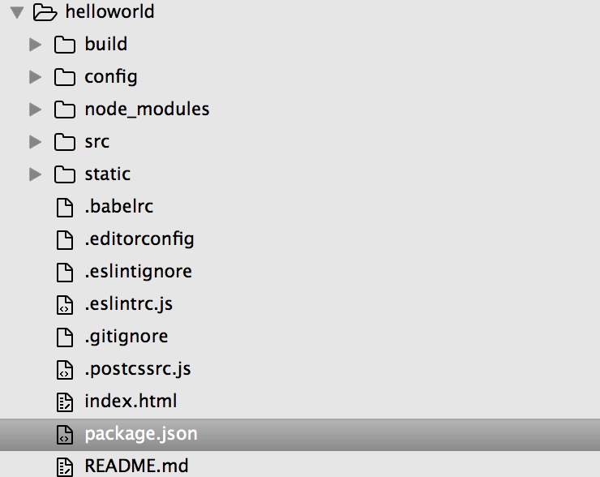
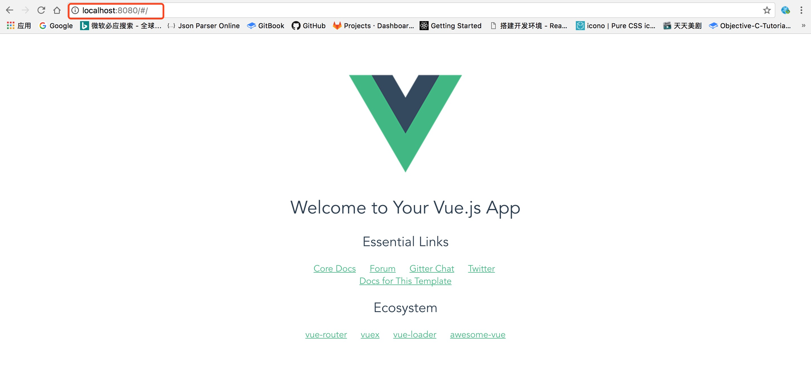

# Vue


**Vue.js** 是一套构建用户界面的 **渐进式框架**,具体什么意思还没弄懂！！

本文档主要参考了参考文档中的内容，并添加了一些自己的理解，仅用于个人学习

## 目录

- [安装](#安装)
- [Vue实例](#md/Vue实例.md)
- [模板语法](#md/模板语法.md)
- [计算属性](#md/计算属性.md)
- [参考文档](#参考文档)

## [安装](https://cn.vuejs.org/v2/guide/installation.html)

安装分为`两种`方式  

### 独立版本

> 通过`<script>` 标签方式引用，`Vue` 会被注册为一个`全局变量`   
> **在开发时请用开发版本，遇到常见错误它会给出友好的警告**  

  - `开发版`：包含完整的警告和调试模式
  - `生产版`：删除了警告

#### cdn

推荐：[unpkg](https://unpkg.com/vue), 会保持和 npm 发布的最新的版本一致
  
### npm构建

这里也分为两种方式:`独立构建`和`运行构建`,它们的区别在于前者包含`模板编译器`而后者不包含

> 模板编译用于编译 Vue 模板字符串成纯 JavaScript 渲染函数。如果你想用 template 选项， 你需要编译。  
> 模板编译器的职责是将模板字符串编译为纯 JavaScript 的渲染函数。如果你想要在组件中使用 template 选项，你就需要编译器。  

  - 独立构建包含模板编译器并支持 template 选项。 它也依赖于浏览器的接口的存在，所以你不能使用它来为服务器端渲染。  
  - 运行时构建不包含模板编译器，因此不支持 template 选项，只能用 render > 选项，但即使使用运行时构建，在单文件组件中也依然可以写模板，因为单文件组件的模板会在构建时预编译为 render 函数。运行时构建比独立构建要轻量30%，只有 17.14 > Kb min+gzip大小

-- [独立构建-vs-运行时构建](https://cn.vuejs.org/v2/guide/installation.html#独立构建-vs-运行时构建)

默认 NPM 包导出的是 运行时 构建。为了使用独立构建，在 webpack 配置中添加下面的别名：

```js
resolve: {
  alias: {
    'vue$': 'vue/dist/vue.common.js'
  }
}
```

### 命令行工具

官方提供了命令行工具，可以快速的构建Vue开发环境

```shell
# 全局安装 vue-cli
$ npm install --global vue-cli
# 创建一个基于 webpack 模板的新项目
$ vue init webpack helloworld
# 
$ cd helloworld
# 安装依赖
$ npm install
# 编译dev
$ npm run dev
```

如我创建了一个`hellorworld`项目，创建时会提示输入构建选项：

```shell
$ vue init webpack helloworld

  This will install Vue 2.x version of the template.

  For Vue 1.x use: vue init webpack#1.0 helloworld

? Project name helloworld
? Project description A Vue.js project
? Author xing.he <1245036094@qq.com>
? Vue build standalone
? Install vue-router? Yes
? Use ESLint to lint your code? Yes
? Pick an ESLint preset Standard
? Setup unit tests with Karma + Mocha? Yes
? Setup e2e tests with Nightwatch? No

   vue-cli · Generated "helloworld".

   To get started:

     cd helloworld
     npm install
     npm run dev

   Documentation can be found at https://vuejs-templates.github.io/webpack
```

最终目录结构如下：



通过`npm run dev` 编译，会在`http://localhost:8080` 启动服务



## 参考文档

[Vue.js](https://cn.vuejs.org/v2/guide/installation.html)
[Github](https://github.com/vuejs/vue)