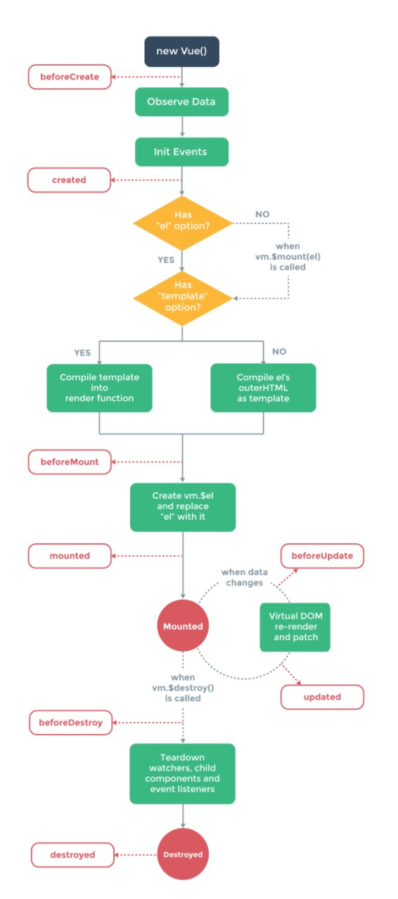

# Vue 实例

## 构造器
每个 Vue.js 应用都是通过构造函数 Vue 创建一个 Vue 的根实例 启动的：

```js
var vm = new Vue({
  // 选项
})
```

在实例化 Vue 时，需要传入一个选项对象，它可以包含数据、模板、挂载元素、方法、生命周期钩子等选项。全部的选项可以在 [API 文档](https://cn.vuejs.org/v2/api/)中查看

**构造器扩展** 可以扩展 Vue 构造器，从而创建自定义初始化选项的构造器

```js
var MyVue = Vue.extend({
  // 扩展选项
})
// 所有的 `MyVue` 实例都将以预定义的扩展选项被创建
var MyVueInstance = new MyVue()
```

这样我们初始化实例时就都会使用默认选项啦...

## 属性与方法

每个 Vue 实例都会 **代理**（个人理解为做了一个关联，将data的`子属性`直接挂载到vue实例下面） 其 data 对象里所有的属性：

```js
var data = { a: 1 }
var vm = new Vue({
  data: data
})

// vm对象就可以直接使用data属性下面的子属性，由于是代理属性，因此这应该是一个 `地址引用`，更改任何一方的值都会改变双方的值

vm.a === data.a // -> true
// 设置属性也会影响到原始数据
vm.a = 2
data.a // -> 2
// ... 反之亦然
data.a = 3
vm.a // -> 3
```

除了 data 属性， Vue 实例暴露了一些有用的`实例属性`与`方法`。这些属性与方法都有`前缀 $`，以便与代理的 data 属性区分:

```js
var data = { a: 1 }
var vm = new Vue({
  el: '#example',
  data: data
})

// 这样就可以通过 VueInstance.$* 调用实例对象下抛出的方法或属性，如 vm.$data 就是 vm.data ,即 data对象。

vm.$data === data // -> true
vm.$el === document.getElementById('example') // -> true
// $watch 是一个实例方法
vm.$watch('a', function (newVal, oldVal) {
  // 这个回调将在 `vm.a`  改变后调用
})
```

常用的`$*`属性或方法

- `$data` : 实例对象下的data对象
- `$el` : 实例对象挂载（渲染）的dom对象
- `$watch` : 这个方法会监听`data`属性下面的值`改变`，有两个参数，第一个参数是要监听的`key`, 第二个参数是一个回调函数callback(oldVlaue,newValue)，**需要注意** 的是，**es6 的`箭头函数`会自动绑定`this`,这样函数内this就不是我们创建的Vue实例了，因此这里不要使用箭头函数**

## 生命周期

每个Vue对象从创建到销毁都有一系列的操作，而这些过程就是Vue实例的生命周期，主要分为 `beforeCreate` `create`  `beforeMount` `mounted` `beforeUpdate` `updated` `beforeDestroyed` `destroyed`

